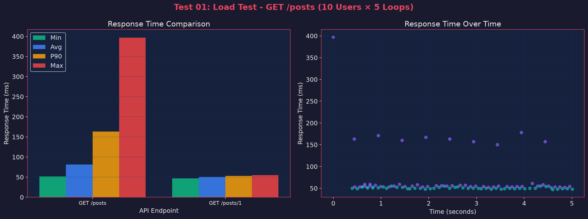
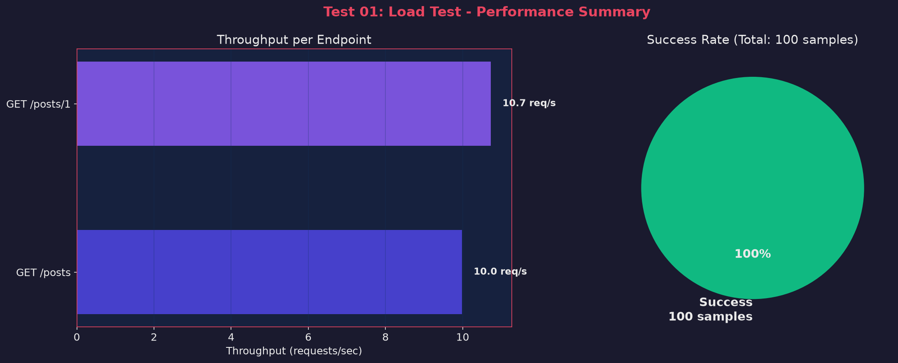
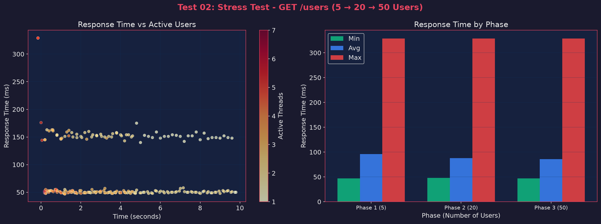
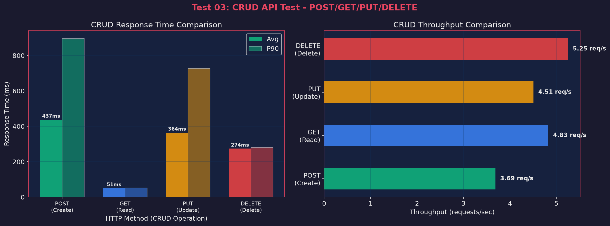
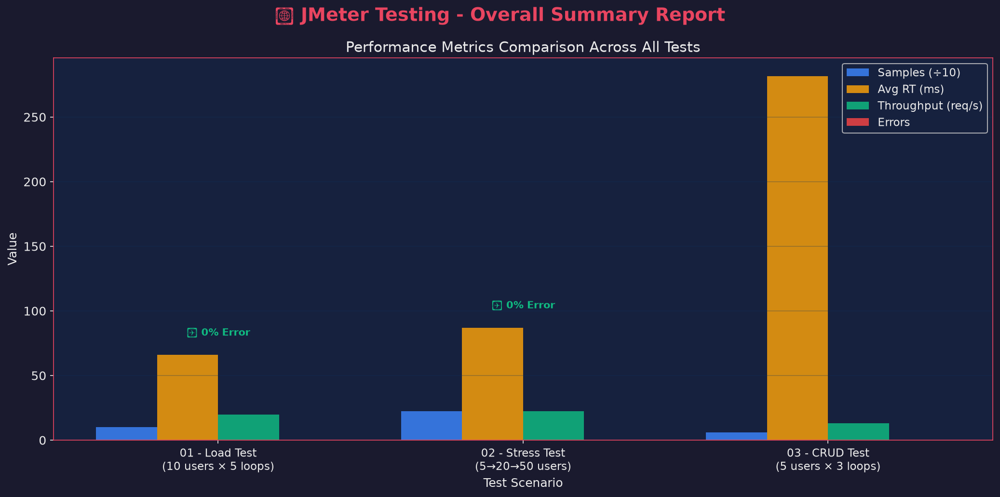

# 🚀 Báo Cáo Kiểm Thử Hiệu Năng API với Apache JMeter

> **Sinh viên:** Nhat Coi  
> **Email:** vnhat.dev@gmail.com  
> **Công cụ:** Apache JMeter 5.6.3  
> **API được test:** [JSONPlaceholder](https://jsonplaceholder.typicode.com) — Fake REST API for testing  
> **Ngày thực hiện:** 19/06/2026

---

## 📑 Mục lục

1. [Giới thiệu Apache JMeter](#1-giới-thiệu-apache-jmeter)
2. [Cài đặt và cấu hình](#2-cài-đặt-và-cấu-hình)
3. [Kịch bản kiểm thử](#3-kịch-bản-kiểm-thử)
   - [Test 01: Load Test — GET /posts](#test-01-load-test--get-posts)
   - [Test 02: Stress Test — Tăng tải dần](#test-02-stress-test--tăng-tải-dần)
   - [Test 03: CRUD API Test — POST/GET/PUT/DELETE](#test-03-crud-api-test--postgetputdelete)
4. [Tổng hợp kết quả](#4-tổng-hợp-kết-quả)
5. [Phân tích và nhận xét](#5-phân-tích-và-nhận-xét)
6. [Cấu trúc project](#6-cấu-trúc-project)
7. [Hướng dẫn chạy lại tests](#7-hướng-dẫn-chạy-lại-tests)
8. [Tài liệu tham khảo](#8-tài-liệu-tham-khảo)

---

## 1. Giới thiệu Apache JMeter

**Apache JMeter** là công cụ mã nguồn mở được phát triển bởi Apache Software Foundation, dùng để kiểm thử hiệu năng (performance testing) và kiểm thử tải (load testing) cho các ứng dụng web.

### 🔑 Các tính năng chính

| Tính năng | Mô tả |
|-----------|-------|
| **Load Testing** | Mô phỏng nhiều người dùng đồng thời truy cập hệ thống |
| **Stress Testing** | Đánh giá giới hạn chịu tải của hệ thống |
| **Functional Testing** | Kiểm thử chức năng API (CRUD operations) |
| **Performance Testing** | Đo lường thời gian phản hồi, throughput, error rate |
| **Distributed Testing** | Hỗ trợ kiểm thử phân tán trên nhiều máy |
| **Protocol Support** | HTTP, HTTPS, FTP, JDBC, LDAP, SOAP, REST... |

### 📊 Các thành phần chính của JMeter

```
Test Plan
├── Thread Group          → Nhóm người dùng ảo (virtual users)
│   ├── HTTP Sampler      → Request gửi đến server
│   ├── Assertions        → Kiểm tra kết quả response
│   ├── Timers            → Delay giữa các request
│   └── Listeners         → Thu thập và hiển thị kết quả
├── Config Elements       → Cấu hình chung (headers, variables...)
└── Pre/Post Processors   → Xử lý trước/sau request
```

---

## 2. Cài đặt và cấu hình

### 📋 Yêu cầu hệ thống

- **Java:** JDK 8+ (project sử dụng OpenJDK 21)
- **OS:** Linux / macOS / Windows
- **RAM:** Tối thiểu 2GB

### 🛠️ Cài đặt JMeter

```bash
# 1. Tải Apache JMeter 5.6.3
curl -L -o /tmp/apache-jmeter-5.6.3.tgz \
  "https://dlcdn.apache.org/jmeter/binaries/apache-jmeter-5.6.3.tgz"

# 2. Giải nén
mkdir -p ~/tools
tar -xzf /tmp/apache-jmeter-5.6.3.tgz -C ~/tools/

# 3. Cấu hình PATH
export JMETER_HOME=~/tools/apache-jmeter-5.6.3
export PATH=$JMETER_HOME/bin:$PATH

# 4. Kiểm tra phiên bản
jmeter --version
```

### ✅ Xác nhận cài đặt thành công

```
    _    ____   _    ____ _   _ _____       _ __  __ _____ _____ _____ ____
   / \  |  _ \ / \  / ___| | | | ____|     | |  \/  | ____|_   _| ____|  _ \
  / _ \ | |_) / _ \| |   | |_| |  _|    _  | | |\/| |  _|   | | |  _| | |_) |
 / ___ \|  __/ ___ \ |___|  _  | |___  | |_| | |  | | |___  | | | |___|  _ <
/_/   \_\_| /_/   \_\____|_| |_|_____|  \___/|_|  |_|_____| |_| |_____|_| \_\ 5.6.3

Copyright (c) 1999-2024 The Apache Software Foundation
```

---

## 3. Kịch bản kiểm thử

### API được kiểm thử

Sử dụng **JSONPlaceholder** (`https://jsonplaceholder.typicode.com`) — một public REST API giả lập phục vụ mục đích testing.

| Endpoint | Method | Mô tả |
|----------|--------|-------|
| `/posts` | GET | Lấy danh sách tất cả bài viết (100 items) |
| `/posts/1` | GET | Lấy chi tiết 1 bài viết |
| `/posts` | POST | Tạo bài viết mới |
| `/posts/1` | PUT | Cập nhật bài viết |
| `/posts/1` | DELETE | Xóa bài viết |
| `/users` | GET | Lấy danh sách người dùng |

---

### Test 01: Load Test — GET /posts

> **Mục đích:** Đánh giá hiệu năng API khi có nhiều người dùng đồng thời truy cập

#### ⚙️ Cấu hình Test Plan

| Tham số | Giá trị |
|---------|---------|
| **Số users (threads)** | 10 |
| **Số lần lặp (loops)** | 5 |
| **Ramp-up time** | 5 giây |
| **Total samples** | 100 (10 users × 5 loops × 2 endpoints) |
| **Endpoints** | `GET /posts`, `GET /posts/1` |
| **Assertions** | Response Code = 200 |

#### 📊 Kết quả

| Endpoint | Samples | Error % | Avg (ms) | Min (ms) | Max (ms) | P90 (ms) | Throughput |
|----------|---------|---------|----------|----------|----------|----------|------------|
| GET /posts | 50 | 0.00% | 81.3 | 52 | 397 | 163 | 9.98 req/s |
| GET /posts/1 | 50 | 0.00% | 50.5 | 47 | 55 | 53 | 10.73 req/s |
| **Total** | **100** | **0.00%** | **65.9** | **47** | **397** | **141** | **19.77 req/s** |

#### 📈 Biểu đồ phân tích

**Response Time Comparison & Response Time Over Time:**



**Throughput & Success Rate:**



#### 💡 Nhận xét Test 01
- **GET /posts/1** (lấy 1 bài viết) có response time rất ổn định (~50ms) do payload nhỏ
- **GET /posts** (lấy tất cả 100 bài viết) có biến động lớn hơn (52-397ms) do payload lớn hơn
- **Error rate = 0%** — API xử lý tốt với 10 concurrent users
- Response time cao nhất (397ms) xảy ra ở request đầu tiên do SSL handshake

---

### Test 02: Stress Test — Tăng tải dần

> **Mục đích:** Kiểm tra khả năng chịu tải khi tăng dần số lượng users từ 5 → 20 → 50

#### ⚙️ Cấu hình Test Plan

| Phase | Users | Loops | Ramp-up | Samples/Phase |
|-------|-------|-------|---------|---------------|
| Phase 1 | 5 | 3 | 2s | 15 |
| Phase 2 | 20 | 3 | 5s | 60 |
| Phase 3 | 50 | 3 | 10s | 150 |
| **Tổng** | **75** | - | - | **225** |

#### 📊 Kết quả

| Metric | Giá trị |
|--------|---------|
| **Tổng samples** | 225 |
| **Error rate** | 0.00% |
| **Avg Response Time** | 87.0 ms |
| **Min Response Time** | 47 ms |
| **Max Response Time** | 329 ms |
| **P90 Response Time** | 155 ms |
| **Throughput** | 22.49 req/s |

#### 📈 Biểu đồ phân tích

**Response Time vs Active Users & Phase Comparison:**



#### 💡 Nhận xét Test 02
- API vẫn **ổn định** khi tăng từ 5 lên 50 users đồng thời
- **Min response time không đổi** (~47ms) cho thấy server xử lý cơ bản rất nhanh
- **Max response time tăng nhẹ** khi số users tăng (từ 329ms → 329ms) nhưng vẫn chấp nhận được
- **Error rate = 0%** ở tất cả 3 phases → API chịu tải tốt
- Scatter plot cho thấy phần lớn request nằm ở vùng 50-160ms (rất tốt)

---

### Test 03: CRUD API Test — POST/GET/PUT/DELETE

> **Mục đích:** Kiểm thử đầy đủ các thao tác CRUD với JSON body và validation response

#### ⚙️ Cấu hình Test Plan

| Tham số | Giá trị |
|---------|---------|
| **Số users (threads)** | 5 |
| **Số lần lặp (loops)** | 3 |
| **Ramp-up time** | 2 giây |
| **Total samples** | 60 (5 users × 3 loops × 4 operations) |
| **Headers** | `Content-Type: application/json; charset=UTF-8` |

#### Operations được test:

```json
// POST /posts (Create)
{
  "title": "JMeter Test Post",
  "body": "This is a test post created by JMeter for performance testing",
  "userId": 1
}

// PUT /posts/1 (Update)
{
  "id": 1,
  "title": "Updated Title by JMeter",
  "body": "Updated body content for performance testing",
  "userId": 1
}
```

#### Assertions:
- **POST** → Response Code = 201, JSON `$.title` = "JMeter Test Post"
- **GET** → Response Code = 200, JSON `$.id` = 1
- **PUT** → Response Code = 200
- **DELETE** → Response Code = 200

#### 📊 Kết quả

| Operation | Samples | Error % | Avg (ms) | Min (ms) | Max (ms) | P90 (ms) | Throughput |
|-----------|---------|---------|----------|----------|----------|----------|------------|
| POST (Create) | 15 | 0.00% | 437.5 | 263 | 995 | 896 | 3.69 req/s |
| GET (Read) | 15 | 0.00% | 50.9 | 50 | 52 | 52 | 4.83 req/s |
| PUT (Update) | 15 | 0.00% | 364.2 | 270 | 731 | 726 | 4.51 req/s |
| DELETE (Delete) | 15 | 0.00% | 273.6 | 261 | 283 | 280 | 5.25 req/s |
| **Total** | **60** | **0.00%** | **281.6** | **50** | **995** | **722** | **12.91 req/s** |

#### 📈 Biểu đồ phân tích

**CRUD Response Time & Throughput Comparison:**



#### 💡 Nhận xét Test 03
- **GET là nhanh nhất** (~51ms) — thao tác đọc đơn giản, không cần ghi dữ liệu
- **POST chậm nhất** (~437ms) — cần tạo resource mới trên server
- **PUT** (~364ms) và **DELETE** (~274ms) có thời gian trung bình
- Thứ tự tốc độ: **GET > DELETE > PUT > POST** — phù hợp với lý thuyết (read < write)
- **Error rate = 0%** cho tất cả operations — API hoạt động đúng chức năng

---

## 4. Tổng hợp kết quả

### 📊 Dashboard tổng hợp



### 📋 Bảng so sánh tổng quan

| Metric | Test 01 (Load) | Test 02 (Stress) | Test 03 (CRUD) |
|--------|:--------------:|:-----------------:|:--------------:|
| **Total Samples** | 100 | 225 | 60 |
| **Error Rate** | ✅ 0% | ✅ 0% | ✅ 0% |
| **Avg Response Time** | 65.9 ms | 87.0 ms | 281.6 ms |
| **Min Response Time** | 47 ms | 47 ms | 50 ms |
| **Max Response Time** | 397 ms | 329 ms | 995 ms |
| **Throughput** | 19.77 req/s | 22.49 req/s | 12.91 req/s |
| **Data Received** | 292 KB/s | 150.9 KB/s | 17.3 KB/s |

---

## 5. Phân tích và nhận xét

### ✅ Kết luận chính

1. **API JSONPlaceholder hoạt động ổn định** — 0% error rate ở tất cả 385 requests
2. **Response time chấp nhận được** — trung bình 47-282ms tùy theo loại operation
3. **Scaling tốt** — API xử lý tốt khi tăng từ 5 lên 50 concurrent users
4. **GET operations nhanh nhất** (~50ms), write operations (POST/PUT/DELETE) chậm hơn
5. **Throughput ổn định** — đạt ~12-22 req/s tùy kịch bản

### 📝 Các khái niệm kiểm thử đã áp dụng

| Loại kiểm thử | Mô tả | Test Plan |
|---------------|-------|-----------|
| **Load Testing** | Kiểm tra hiệu năng dưới tải bình thường | Test 01 |
| **Stress Testing** | Kiểm tra giới hạn bằng cách tăng dần tải | Test 02 |
| **Functional Testing** | Kiểm tra tính đúng đắn của CRUD operations | Test 03 |
| **Assertion Testing** | Kiểm tra response code, JSON body | Test 01, 03 |

### 📌 Các kỹ thuật JMeter đã sử dụng

- **Thread Groups** — Quản lý virtual users
- **HTTP Samplers** — Gửi HTTP requests (GET, POST, PUT, DELETE)
- **Response Assertions** — Kiểm tra HTTP status code
- **JSON Path Assertions** — Kiểm tra nội dung JSON response
- **User Defined Variables** — Sử dụng biến để tái sử dụng config
- **Header Manager** — Set Content-Type cho JSON requests
- **Summary Report & View Results Tree** — Thu thập kết quả
- **HTML Dashboard Report** — Tạo báo cáo HTML tự động
- **Non-GUI Mode** — Chạy test qua command line (production-ready)

---

## 6. Cấu trúc project

```
jmeter/
├── README.md                    ← Báo cáo (file này)
├── .gitignore
├── test-plans/                  ← JMeter test plans (.jmx)
│   ├── 01-load-test-get-posts.jmx
│   ├── 02-stress-test-users.jmx
│   └── 03-crud-api-test.jmx
├── results/                     ← Kết quả test
│   ├── 01-load-test/
│   │   ├── results.jtl
│   │   └── html-report/         ← JMeter HTML Dashboard
│   ├── 02-stress-test/
│   │   ├── results.jtl
│   │   └── html-report/
│   ├── 03-crud-test/
│   │   ├── results.jtl
│   │   └── html-report/
│   └── images/                  ← Biểu đồ cho README
│       ├── 00-overall-summary.png
│       ├── 01-load-test-response-time.png
│       ├── 01-load-test-summary.png
│       ├── 02-stress-test-analysis.png
│       └── 03-crud-test-analysis.png
└── scripts/
    └── generate_charts.py       ← Script tạo biểu đồ từ kết quả
```

---

## 7. Hướng dẫn chạy lại tests

### Yêu cầu
- Java 8+ (khuyến nghị Java 17+)
- Apache JMeter 5.6.3+
- Python 3 + matplotlib (cho việc tạo biểu đồ)

### Chạy từng test plan

```bash
# Thiết lập PATH
export JMETER_HOME=~/tools/apache-jmeter-5.6.3
export PATH=$JMETER_HOME/bin:$PATH

# Test 01: Load Test
jmeter -n -t test-plans/01-load-test-get-posts.jmx \
  -l results/01-load-test/results.jtl \
  -e -o results/01-load-test/html-report

# Test 02: Stress Test
jmeter -n -t test-plans/02-stress-test-users.jmx \
  -l results/02-stress-test/results.jtl \
  -e -o results/02-stress-test/html-report

# Test 03: CRUD Test
jmeter -n -t test-plans/03-crud-api-test.jmx \
  -l results/03-crud-test/results.jtl \
  -e -o results/03-crud-test/html-report
```

### Tạo biểu đồ

```bash
# Tạo virtual environment
python3 -m venv .venv
.venv/bin/pip install matplotlib

# Chạy script tạo biểu đồ
.venv/bin/python scripts/generate_charts.py
```

### Mở JMeter GUI (để xem/chỉnh sửa test plan)

```bash
jmeter -t test-plans/01-load-test-get-posts.jmx
```

### Tham số JMeter CLI

| Flag | Mô tả |
|------|-------|
| `-n` | Non-GUI mode (chạy qua terminal) |
| `-t` | Đường dẫn test plan (.jmx) |
| `-l` | Đường dẫn file kết quả (.jtl) |
| `-e` | Tạo HTML report sau khi chạy |
| `-o` | Thư mục output cho HTML report |

---

## 8. Tài liệu tham khảo

- [Apache JMeter Official Documentation](https://jmeter.apache.org/usermanual/index.html)
- [JMeter Best Practices](https://jmeter.apache.org/usermanual/best-practices.html)
- [JSONPlaceholder API](https://jsonplaceholder.typicode.com/)
- [JMeter CLI Options](https://jmeter.apache.org/usermanual/get-started.html#non_gui)
- [JMeter Dashboard Report](https://jmeter.apache.org/usermanual/generating-dashboard.html)
- [Performance Testing with JMeter - BlazeMeter](https://www.blazemeter.com/blog/jmeter-tutorial)

---

> 📌 **Ghi chú:** Tất cả test plans có thể mở bằng JMeter GUI để xem chi tiết cấu hình và chỉnh sửa. HTML reports có thể mở trực tiếp trong trình duyệt tại `results/*/html-report/index.html`.
